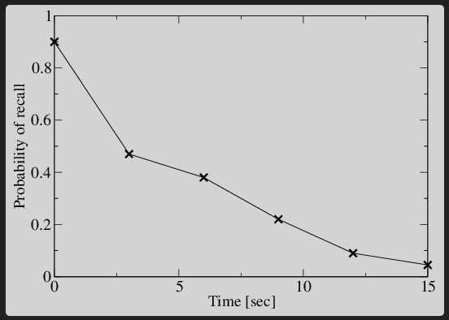

# TDDMooc
## What is TDD?

https://tdd.mooc.fi/

1. Write a list of the test scenarios you want to cover
2. Turn exactly one item on the list into an actula, runnable test
3. Change the code to make the test (& all previous tests) pass (adding
   items to the list as you disover them).
4. Optionally refactor to improve the design
5.  Until the list is empty go back to #2


### The three laws of TDD
1. Youshall not write any production code, unless required by a failing unit test.
2. You shall not write more of a unit test, than is required to fail (assertion failure/program crash/compile error)
3.  You shall not write more production code, than is sufficient to make the one failing unit test pass

# <span style="color: red;">Red</span> <span style="color:green">Green</span> <span style="color:purple">Refactor</span>
1. <span style="color: red;">Red</span>: Write a failing test.  Predict (mentally or out loud) how the test shoud fail.  Run the test.  See it fail.  If it failed in an unexpected way, check your assumptions. Improve the failure's readability.  

    If the test fails differently from how you expected, you should stop a moment and think.  Is the code working differently from how you thought?  Is the test not actually testing the thinh it was meant to test? 

    Likewise, if the test passed, and you expected it to fail.  Is the feature already implemented? Does the test have a bug, and it will never fail?

2. <span style="color:green">Green</span>: Make the test pass. ASAP.  Commit any sins necessary.  Hard-coded values. If statements. Fake it until you make it.  It is important not to write any more code  than is required to pass the test. This means at first using hard coded return values and naive implementations.  If we added behaviour without first specifying it with a test, then we would be adding unspecified behavior.

    This is called traingulation when we write tests to expose the deficiencies of still naive production code.  By making those tests pass, the production code approaches a completely tests solution that will handle all edge cases.

3. <span style="color:purple">Refactor</span>: Improve the design of the code, without changing its behavior.  Atone for your sins.  Remove duplication.  Improve names.  Minimal code which passes the current tests.  Make it look as you knew all along what you were doing.

Repeat until there are no more tests or you are bored.

### Test List
To stay focused on the current test and phase, it's helpful to maintain a test list (on paper, a text file or as TODO comments in tests)

## What tests to write?
Ask yourself: What is the most next most important thing, which the system does not yet do?

Stop thinking about _how your software works_. Instead specify _WHAT your software does_ from the point of view of its user.

When writing the first test, it helps to start small and simplify the problem: Where to start writing a Sudoku solver? Solving a 1x1 sudoku.

### Test names should be sentences
The test names should be sentences that descrive what the system should do - its behavior.  Think of them as a specification of what your software does.

If all the production code disappeared and the only thing remaining is the test names. Could someone reimplement the system, so that it will do pretty much the same thing as before?

Corollary:  All test names have disappeared.  Can someone read the test code and understand what behaviour it is specifying, so that they can write a test name which says pretty much the same as it said before?

When a test fails, look at the name of the test - the behaviour that it defines.  There are three possibilities:

- The system has a bug. Fix the implementation
- The behaviour is still needed, but the test needs updating.  Change the test.  Think of how to decouple the test from unrelated behaviours, to have fewer unwanted test failures
- The behaviour is no longer needed. Delete the test

# Refactoring and Design
An essential part of TDD is refactoring.  Improving the structure of the code without changing its observable behaviour.  TDD's tests provide a feedback mechanism: if something is hard to test, it means the codes design needs improvment.  When learning TDD, listening to your tests and learning about design is what takes the longest.

## Evolutionary design
Designing a whole system upfront without mistakes is not possible. At
the start of a project is the time when we know the least about the
problem that we are solving. That's why our design must evolve as we
learn more.  We put our learning back into the program by modifying it
to look as _if we had known what we were doing all along, and as if it
had been easy to do_.

We should _start with an idea of a design, but assume it's wrong_. 
We'll continually look for signs that our curent design doesn't fit the
problem, and then we'll modify the design to fit it better.

But we shouldn't build flexible and reusable components up-front.  They
would increase complexity and anyway might not flex in the right
direction.  Instead, we'll follow the principles of YAGNI and Simple
Design to reduce the friction of changing our design in _any_ direction.

## Four elements of simple design
In priority order:

1. Passes its tests
2. Minimizes duplication
3. Maximises clarity
4. Has fewer elements

With TDD, point 1 is a given.  If points 2 and 3 are covered, then point
4 rarely comes up.  The order between 2 and 3 is debatable.  Thus, the 
rules can be summarized:

- Remove duplication
- Improve names

Keep practicing these, and in a few decades every other design principle
and pattern will emerge.

## Duplication
The Don't Repeat Yourself (DRY) principle says:

>Every piece of knowledge must have a single, unambiguous, authoritative
representation within a system.

The alternative is to have the same thing expressed in two or more 
places.  Then if you need to change one place, you might not remember 
to change the other place, leading to problems.

A common case of duplicated knowledge is similar code in two or more
places.  If the places are _almost_ similar, first try to refactor 
them to be exactly the same code, after which it's easier to extract the
common code to a shared function.

### Three strikes and you refactor
Not all code that looks similar is duplicated knowledge.  Even if chairs
and dogs both have 4 legs, the 4s are not related.

In Conway's Game of Life, the calculation of whether a cell will be alive
in the next generation could be written like this:

```
will_live? = if alive?
        neighbors == 2 || neighbors == 3
    else
        neighbors == 3
```
The _neighbors == 3_ is repeated so lets remove the duplication

```
will_live? = (alive? && neighbors == 2) || neighbors == 3
```

But this is wrong as it couples together two unrelated concepts:

In the original code, the 2 and 4 in the _alive?_ branch are 
related to the concept of a 'scalable neighborhood', whereas
the 3 in the _not alive?_ branche means 'genetically fertile
neighborhood'.

By naming these concepts it becomes clear that they are not
actually duplicated:

```
will_live? = if alive?
        stable_neighborhood
    else
        genetically_fertile_neighborhood
```

## Naming things
> There are only two hard things in Computer Science: Cache invalidation
and naming things

Removing duplication and improving names feed into each other in a 
virtuous cycle.

Naming is a process: nonsense --> accurate-but-vague --> precise -->
meaninful.  Never stop improving.

## Composed method
> Divide your program into methods that perform one identifiable task.
Keep all of the operations in a method at the same level of abstraction.
This will naturally result in programs with many small methods, each a 
few lines long.

Each new method is an opportunity to introduce a new name.

The code should read like a newspaper article.  First, the high level
overview, then dig deeper into more details.

Keep in mind that each refactoring can be done in two directions: If 
you inline everything into one big method, it may be possible to see a
different way to split it into smaller methods.

## Small, safe steps
To do a refactoring with far-reaching consequences, you have two 
options:

- **One big change:** Carefully analyze the whole codebase to figure
out every place that must be changed, and then change all those places
at the same time.  It may take hours to read the codebase and you could
still miss some side effect.  When tests break after your changes
- **Many small changes:** Plan a series of changes, each of which can 
be proven through local reasoning to not change behavior.  Start the 
refactoring from one place and propgate it in tiny increments by making
mechanical changes which require very little thinking.  There could be 
10 or 100 times more steps, but each of them takes just a couple of 
seconds.  When tests break after your changes, the problem should be
near the line you changed 5 seconds ago.

Many small changes is faster than one big change.

When you refactor, don't change behavior.  When you change behavior, 
don't refactor.  Maintain three points of contact like a mountain climber.

### Refactoring hell
If it's been more than a few minutes since the last tests passes, ```git
reset --hard``` and try again using smaller steps.

## Four strategies
There are four strategies to refactor and design using small, safe 
steps:

- ***Leap:*** The change is small enough. Just do it.
- ***Parallel:*** Build the new solution side-by-side with the old
solution, until the new can replace the old
- ***Stepping stone:*** You want to build thing A, but if you built
thing B first, that could make it easier to build thing A. (Beware
of gold plating).
- ***Simplification:*** Solve a trivialized version of the problem
first.  1x1 Sudoku

## Test quality
Tests should be sensitive to behavior changes and insensitive to
structure changes.

Each test should be only one thing.

Each bug should cause only one test to fail.

From the pattern of failing tests, it should be possible to guess
in which function or line the problem is.

If some code can be commented out and no test fails, the code 
should be dead.

In five seconds, you will have forgotten over half of your working
memory. Make the tests so fast that you won't forget what you are
thinking.



### Test smells
Like there are many code smells, there are alos test smells. Here
are a couple to look our for:

***Many asserts per test:*** Normally tests are structured in the 
'Arrange-Act-Assert'/'Given-When-Then'/'Hoare Triple' format. But
if they are instead _Arrange-Act-Assert-Act..._ that usually indicates
that a test is lacking focus and testing many different things 
(making the test's purpose harder to deciper), or that it's testing
_how_ the system does things instead of testing _what_ the system
does (making refactoring harder).  Depending on the testing framework,
earlier test failures may also mask later test failures, making it
harder to know why the test failed.  Instead, write many small, 
focused tests.

**Complex test setup:*** If the _arrange_ part of a test is long, 
requiring the careful arrangement of many collaborators to get the
system into the desired initial state for the test, it may indicate
design problems in the code. Lots of constructor arguments is a 
similar smell (which is why dependency injection frameworks are best
avoided - they make it too easy to add dependencies).  Instead, try to
think of a design which eliminates some of the dependencies.

https://tdd.mooc.fi/2-design/
