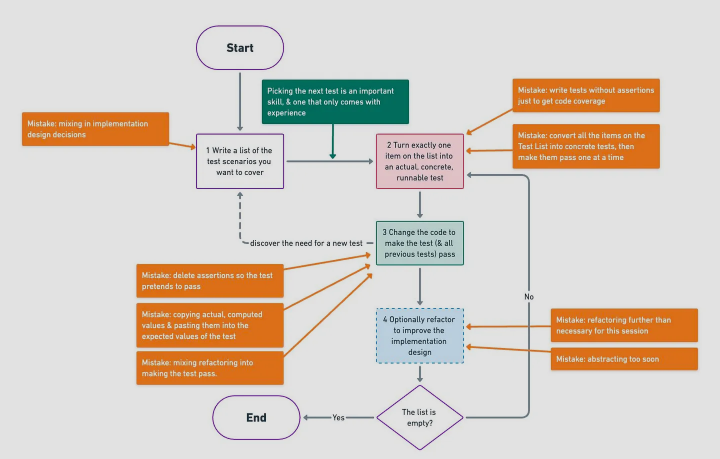

# TDDMooc
## What is TDD?

1. Write a list of the test scenarios you want to cover
2. Turn exactly one item on the list into an actula, runnable test
3. Change the code to make the test (& all previous tests) pass (adding
   items to the list as you disover them).
4. Optionally refactor to improve the design
5.  Until the list is empty go back to #2

### The three laws of TDD
1. Youshall not write any production code, unless required by a failing unit test.
2. You shall not write more of a unit test, than is required to fail (assertion failure/program crash/compile error)
3.  You shall not write more production code, than is sufficient to make the one failing unit test pass

# Red Green Refactor
1. Red: Write a failing test.  Predict (mentally or out loud) how the test shoud fail.  Run the test.  See it fail.  If it failed in an unexpected way, check your assumptions. Improve the failure's readability.  

    If the test fails differently from how you expected, you should stop a moment and think.  Is the code working differently from how you thought?  Is the test not actually testing the thinh it was meant to test? 

    Likewise, if the test passed, and you expected it to fail.  Is the feature already implemented? Does the test have a bug, and it will never fail?

2. Green: Make the test pass. ASAP.  Commit any sins necessary.  Hard-coded values. If statements. Fake it until you make it.  It is important not to write any more code  than is required to pass the test. This means at first using hard coded return values and naive implementations.  If we added behaviour without first specifying it with a test, then we would be adding unspecified behavior.

    This is called traingulation when we write tests to expose the deficiencies of still naive production code.  By making those tests pass, the production code approaches a completely tests solution that will handle all edge cases.

3. Refactor: Improve the design of the code, without changing its behavior.  Atone for your sins.  Remove duplication.  Improve names.  Minimal code which passes the current tests.  Make it look as you knew all along what you were doing.

Repeat until there are no more tests or you are bored.

### Test List
To stay focused on the current test and phase, it's helpful to maintain a test list (on paper, a text file or as TODO comments in tests)

## What tests to write?
Ask yourself: What is the most next most important thing, which the system does not yet do?

Stop thinking about _how your software works_. Instead specify _WHAT your software does_ from the point of view of its user.

When writing the first test, it helps to start small and simplify the problem: Where to start writing a Sudoku solver? Solving a 1x1 sudoku.

### Test names should be sentences
The test names should be sentences that descrive what the system should do - its behavior.  Think of them as a specification of what your software does.

If all the production code disappeared and the only thing remaining is the test names. Could someone reimplement the system, so that it will do pretty much the same thing as before?

Corollary:  All test names have disappeared.  Can someone read the test code and understand what behaviour it is specifying, so that they can write a test name which says pretty much the same as it said before?

When a test fails, look at the name of the test - the behaviour that it defines.  There are three possibilities:

- The system has a bug. Fix the implementation
- The behaviour is still needed, but the test needs updating.  Change the test.  Think of how to decouple the test from unrelated behaviours, to have fewer unwanted test failures
- The behaviour is no longer needed. Delete the test

# Refactoring and Design
An essential part of TDD is refactoring.  Improving the structure of the code without changing its observable behaviour.  TDD's tests provide a feedback mechanism: if something is hard to test, it means the codes design needs improvment.  When learning TDD, listening to your tests and learning about design is what takes the longest.

## Evolutionary design
Designing a whole system upfraont without mistakes is not possible. 

https://tdd.mooc.fi/2-design/
